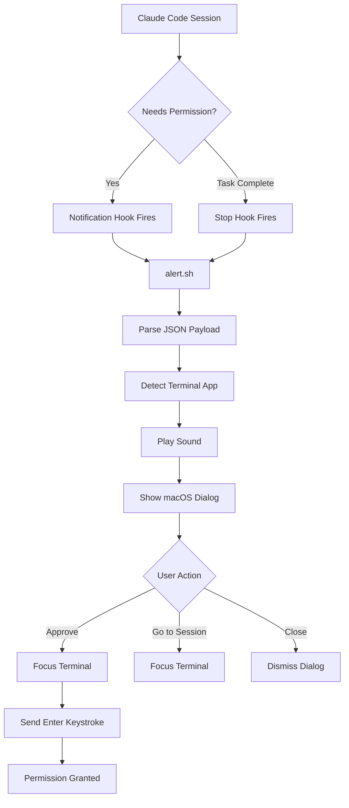
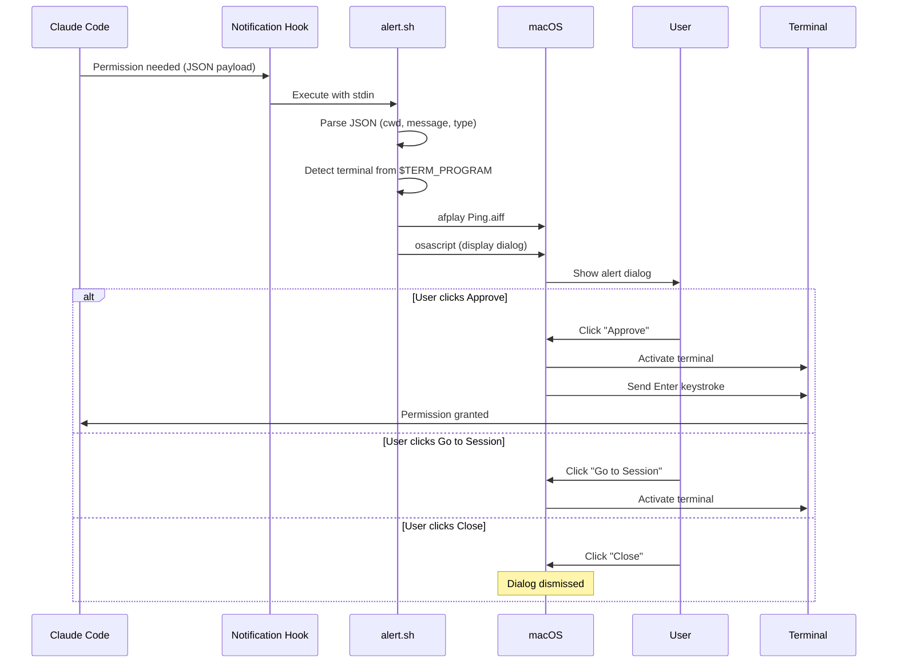

# How Claude Code Alerts Works

## Flow Diagram



## Sequence Diagram



## Hook Payload Example

When Claude Code needs permission, it sends JSON like this to the hook:

```json
{
  "hook_event_name": "Notification",
  "notification_type": "permission_prompt",
  "message": "Claude wants to run: npm install",
  "cwd": "/Users/you/projects/my-app",
  "session_id": "abc123"
}
```

The script extracts:
- `cwd` → Project name for the alert
- `message` → What Claude wants to do
- `notification_type` → Whether to show Approve button
- `hook_event_name` → Which sound to play
